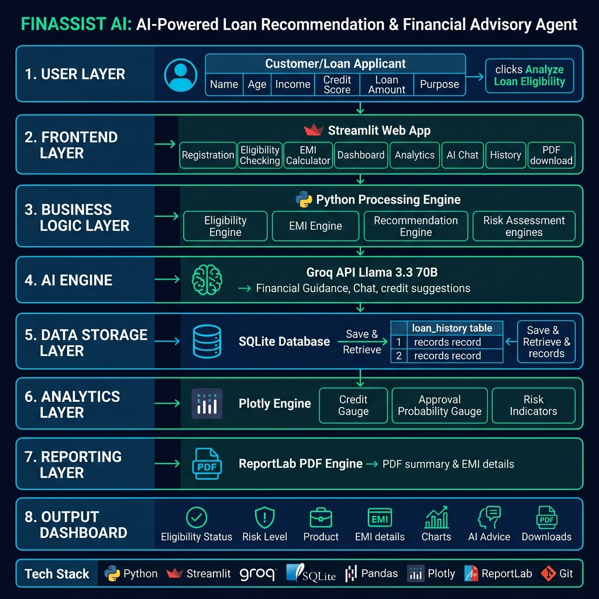
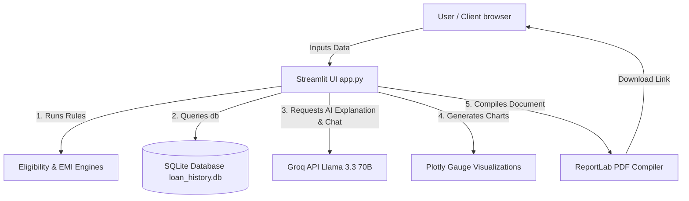
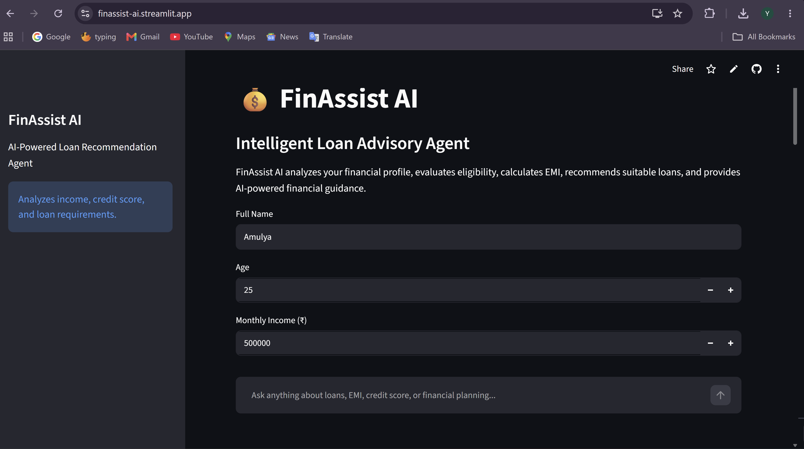
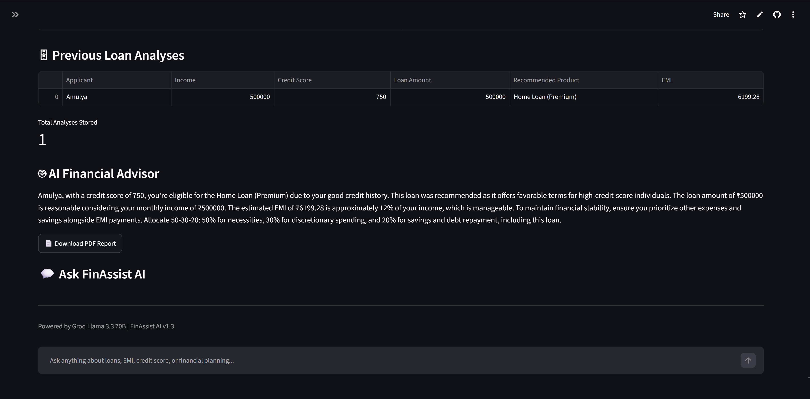

# FinAssist AI – Intelligent Loan Recommendation Agent

An AI-powered financial advisory platform that automates loan eligibility analysis, performs EMI calculations, offers intelligent product recommendations, provides conversational financial advice, and generates professional PDF summaries.

---

## 🌐 Live Demo

[](https://finassist-ai.streamlit.app)


## 📌 Academic & Professional Assets

### Project Objective (Academic Submissions)
> "The objective of this project is to develop a data-driven, AI-enabled Decision Support System (DSS) for consumer lending. By integrating traditional financial rule engines (for eligibility checks and EMI calculation) with a Large Language Model (Llama 3.3 70B via Groq API), the platform aims to democratize financial literacy, reduce information asymmetry in loan acquisition, and provide users with customized, highly explainable financial recommendations and risk profiles."

### Project Summary (Resume Usage)
> **FinAssist AI – Intelligent Loan Recommendation Agent**
> *Developed an AI-powered financial advisor application using Streamlit, Python, and SQLite. Built a rule-based loan eligibility and recommendation engine coupled with Llama 3.3 70B (via Groq API) for dynamic financial advice and natural language chat queries. Integrated Plotly for interactive risk/approval visualization and ReportLab for programmatic PDF financial report generation. Reduced advisory latency and simplified complex financial analysis for retail borrowers.*

### GitHub Description
> *💰 FinAssist AI: An intelligent loan recommendation and financial advisory agent. Combines financial rule engines, SQLite history, Plotly gauges, ReportLab PDF reports, and Llama 3.3 70B for a state-of-the-art consumer lending advisory platform.*

---

## 🎯 Problem Statement
In retail banking, prospective borrowers often struggle to understand their borrowing capacity, compare complex loan products, and comprehend the long-term impact of interest rates and tenure. Traditional banking portals provide static numbers without explaining *why* a customer is eligible or *how* to manage their repayments. FinAssist AI bridges this gap by combining traditional loan metrics calculation with GenAI-driven advisory, providing immediate, transparent, and actionable advice to improve credit standings and choose correct financial products.

---

## 🚀 Features

1. **Loan Eligibility Analysis**: Instant evaluation of credit scores, monthly income, and age limits.
2. **EMI Calculation Engine**: Dynamic amortization check determining the monthly installment based on selected rates.
3. **Loan Recommendation Engine**: Matches credit profile and monthly income weights against Basic, Standard, and Premium loan options.
4. **AI Financial Advisor**: Programmatic integration with Llama 3.3 70B to generate customized explanations about eligibility, recommended products, and budgeting.
5. **Interactive Chat Assistant**: A context-aware chatbot allowing users to ask natural language questions regarding their financial analysis.
6. **SQLite Storage**: Local database backend logging previous loan analyses to track history over time.
7. **Plotly Analytics Dashboard**: Rich visualizations displaying the Credit Score gauge and Approval Probability.
8. **PDF Report Generation**: Instant generation and download of professional PDF assessment reports.

---

## 📐 System Architecture





---

## 🛠️ Technical Stack
* **Language**: Python 3.10+
* **Framework**: Streamlit (Interactive Frontend)
* **LLM Engine**: Groq API (Llama 3.3 70B Versatile model)
* **Database**: SQLite3 (Persistent Loan History)
* **Data Processing**: Pandas
* **Visualization**: Plotly Graph Objects
* **Document Compilation**: ReportLab
* **Version Control**: Git & GitHub
* **IDE**: VS Code

---

## ⚙️ Installation & Setup

Follow these steps to run FinAssist AI locally:

### 1. Clone the Repository
```bash
git clone https://github.com/YashashriPeni/FinAssist-AI.git
cd FinAssist-AI
```

### 2. Create and Activate Virtual Environment
On Windows:
```bash
python -m venv venv
venv\Scripts\activate
```
On macOS/Linux:
```bash
python3 -m venv venv
source venv/bin/activate
```

### 3. Install Dependencies
```bash
pip install -r requirements.txt
```

### 4. Configure Environment Variables
Create a file named `.env` in the root directory:
```env
GROQ_API_KEY=your_actual_groq_api_key_here
```

---

## 📖 Usage Guide

To start the Streamlit application:
```bash
streamlit run app.py
```

### Navigating the App:
1. Enter your **Full Name**, **Age**, **Monthly Income**, **Credit Score**, **Desired Loan Amount**, and **Loan Purpose**.
2. Click **Analyze Loan Eligibility**.
3. Explore the **Loan Assessment Dashboard**, **Financial Analytics charts**, and **Loan Comparison Table**.
4. Read the personalized **AI Financial Advisor** assessment.
5. Click **Download PDF Report** to export your analysis.
6. Interact with the **Ask FinAssist AI** chat window at the bottom to clarify details about credit improvement or loan terms.

---

## 📸 Screenshots

### Home Page & User Input


### Loan Assessment Dashboard


### Financial Analytics & Recommendations


### AI Financial Advisor


### System Architecture

---

## 🔮 Future Enhancements
* **Multi-Bank APIs**: Direct integration with open banking APIs to pull live interest rates.
* **Document Parser**: OCR integration to scan payslips and verify income automatically.
* **Advanced Visualizations**: Detailed amortization schedule tables and graphs.
* **Authentication**: Multi-user login with encrypted session data.

---

## ✍️ Author Information
* **Author Name**: Yashashri Peni
* **Institution/Organization**: MLR Institute of Technology (MLRIT)
* **GitHub**: [@YashashriPeni](https://github.com/YashashriPeni)
